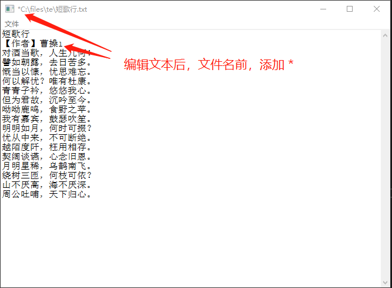
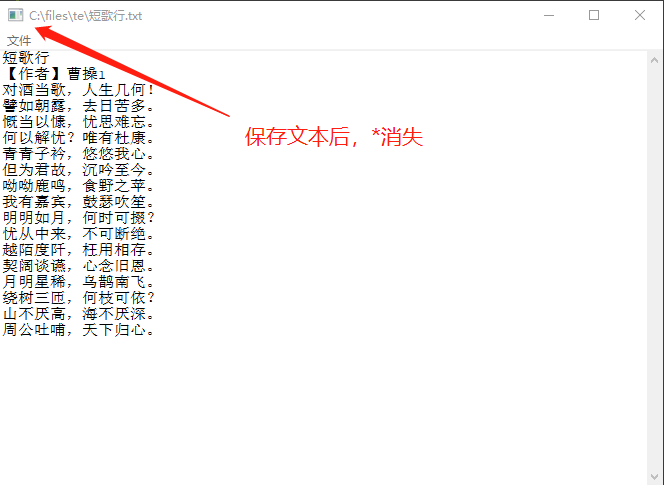
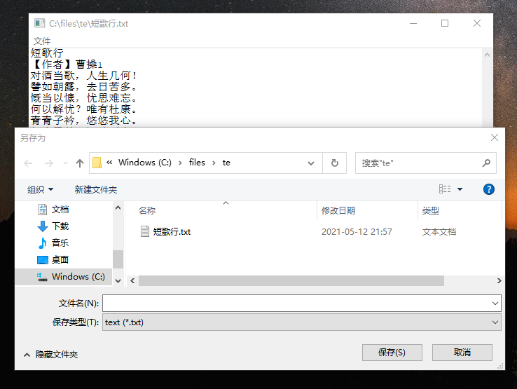
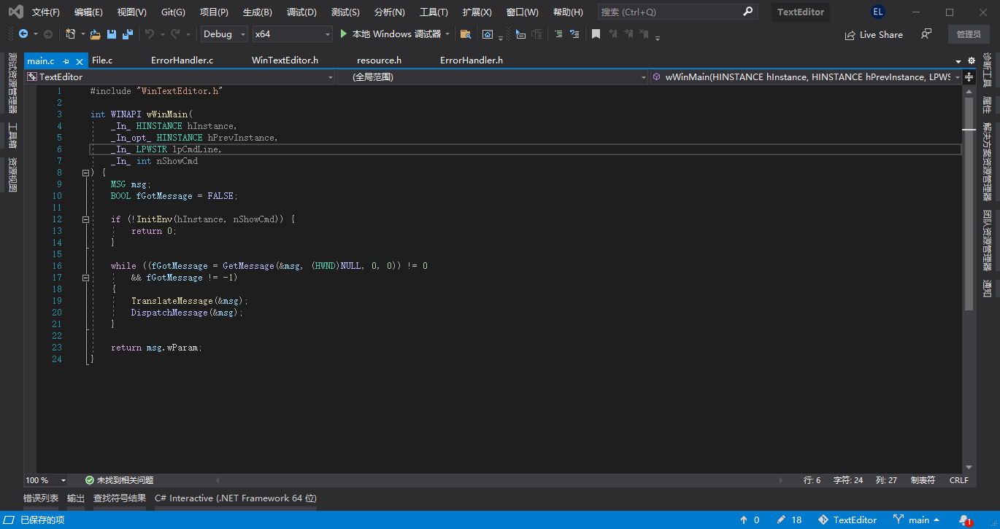
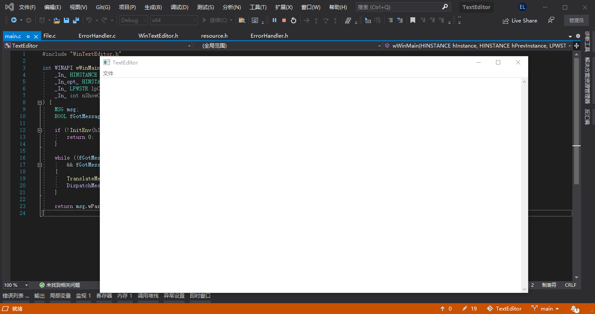

# TextEditor

一个使用 `C` 语言，在 `Windows` 环境下的文本编辑器。
编辑器的实现过程，可以在这篇文章中找到。

# 实现功能

1. 弹出打开文件对话框，打开一个文本文件；
2. 将当前打开的文件另存为另外的文件；
3. 处理编辑器内容变化；

# 一些截图

1. 打开文件


2. 编辑文本



3. 保存



4. 另存为



# 如何运行

1. 运行如下命令，将项目拷贝到本地

```
git clone https://github.com/vitalitylee/TextEditor
```

2. 使用 `Visual Studio` 打开根目录下的 `TextEditor.sln` 文件，注意，最好使用 `Visual Studio 2019` 以上版本



3. 点击运行按钮


